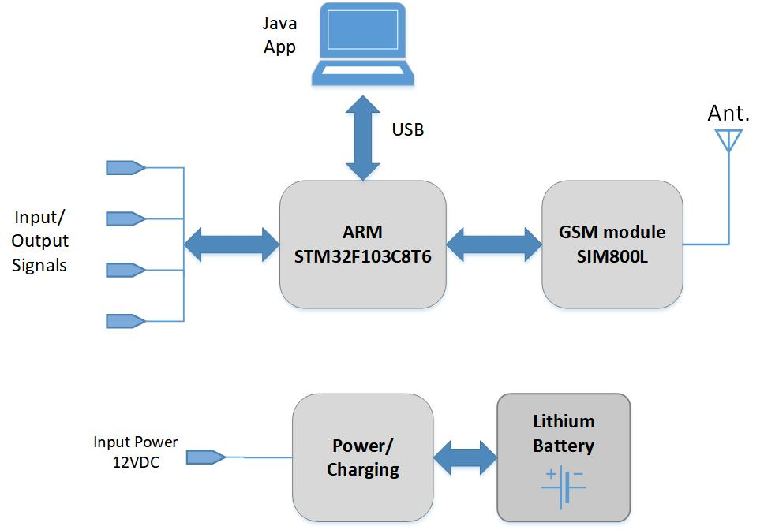
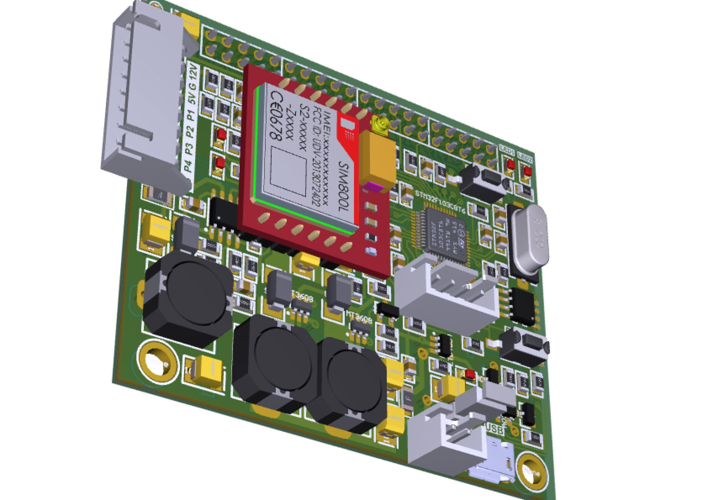
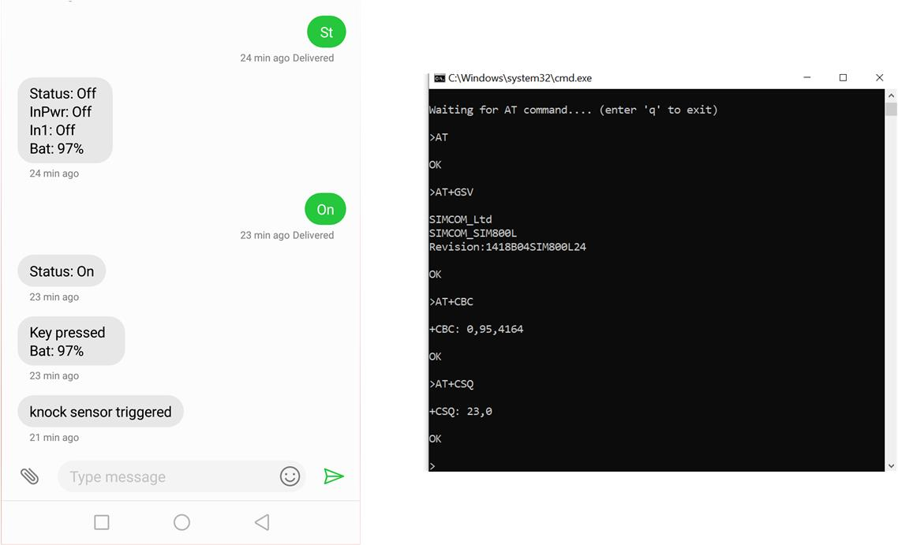

## A simple security/IoT project using SIM800L GSM module 
In this project a SIM800L module is driven by an ARM micro-controller STM32F103C8T6 to implement a simple controlling/security device communicating with a cell phone through GSM network. The device continuously monitors the peripheral sensors such as vision motion detectors or knock sensors, and sends alarms to the cell phone by SMS and calling. The firmware code has been developed through STM32CubeIDE [Firmware_main_code](Firmware_stm32c8t6_sim800l/Src/main.c).   
Moreover, as an option, the device can connect to a PC through USB (HID class) in which a Java application runs. The java app can be used to communicate to the SIM module by AT commands by user. Java program has been developed by NetBeansIDE, [Java_main_code](USBHID_console_Java/src/org/hid4java/org/hid4java/RunHidDevice.java)
 

The device is provided by a Lithium battery and charging circuitry. So in case of input power outage the device is able to operate normally for hours but sends an alarm to the user cell phone. 

 
## Author
### Hamid Reza Tanhaei
